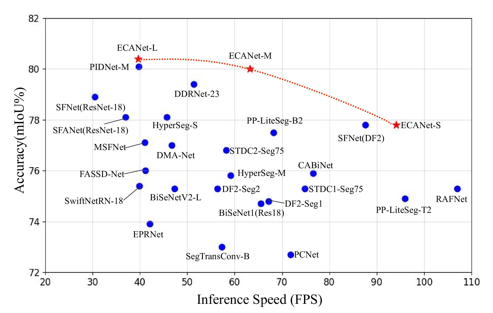
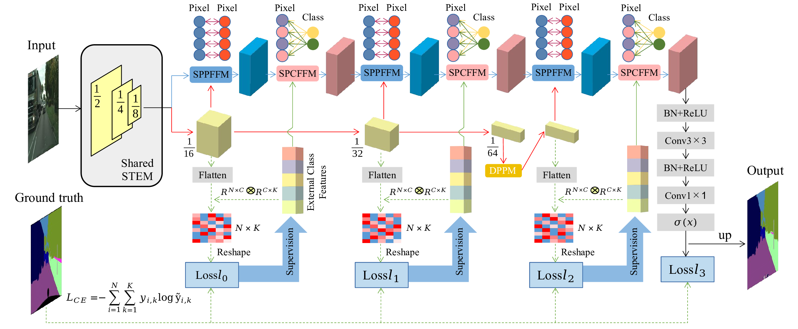

# ECANet
The official implementation of "ECANet:An External-Class-Aware Network for Real-Time Semantic Segmentation of Street Scenes"

# Highlights

Comparison of inference speed and accuracy for real-time models on test set of Cityscapes.

* **External Class Features**: We propose a novel dual-branch network framework, ECANet, which, for the first time, introduces external class features to guide pixel classification, achieving
high-quality real-time segmentation.
* **More Accurate and Faster**: ECANet-S achieves 77.8% mIoU with speed of 94.1
FPS, ECANet-M achieves 80% mIoU with speed
of 63.2 FPS, and ECANet-L achieves 80.4% mIoU with speed
of 39.6 FPS.
* **Efficient Modules**: The novel and efficient modules—SPPFFM, SPCFFM, and DPPM are introduced and can significantly enhance the accuracy of ECANet.

# Overview

The overall architecture of our methods.

# Updates
* Updated the code for testing model speed and the code for the three modules and additional changes will be coming soon. (Nov/26/2024)
* The code for the configs and model is released.(Dec/14/2024)

# Experimental results
|Model(Cityscapes)|Val(%mIOU)|Test(%mIOU)|FPS|
| :---- | :----: | :----: | :----:|
|ECANet-S|78.5|[77.8](https://www.cityscapes-dataset.com/anonymous-results/?id=a4ff978fe602e83e08ce72c71fbcdc411ef7fa00f58602cf7bc1c6a3bc7ffeb7)|94.1|
|ECANet-M|79.55|[80.0](https://www.cityscapes-dataset.com/anonymous-results/?id=47ecf0c6f41ff89fdd1a5dc242ee26c3a72a0196be5b52ad5afbf6f633828747)|63.3|
ECANet-L|80.22|[80.4](https://www.cityscapes-dataset.com/anonymous-results/?id=abd886a829c30011bfcead75a9134c79e5ea3eda393b3dfc788931ec7ecb215b)|39.6|

|Model(Camvid)|Val(%mIOU)|Test(%mIOU)|FPS|
| :---- | :----: | :----: | :----:|
|ECANet-M|-|74.9|91.3|
ECANet-L|-|77.0|70.8|

|Model(BDD)|Val(%mIOU)|Test(%mIOU)|FPS|
| :---- | :----: | :----: | :----:|
|ECANet-M|58.8|-|93.2|

# Prerequisites
This implementation is based on [MMSegmentation](https://github.com/open-mmlab/mmsegmentation). Please refer to their repository for installation and dataset preparation. The inference speed is tested on single RTX 3090 using the method introduced by [DDRNet](https://github.com/ydhongHIT/DDRNet). 

# Acknowledgement
* Our implementation is modified based on [MMSegmentation](https://github.com/open-mmlab/mmsegmentation).
* Latency measurement code is borrowed from the [DDRNet](https://github.com/ydhongHIT/DDRNet).
* Thanks for their nice contribution.
